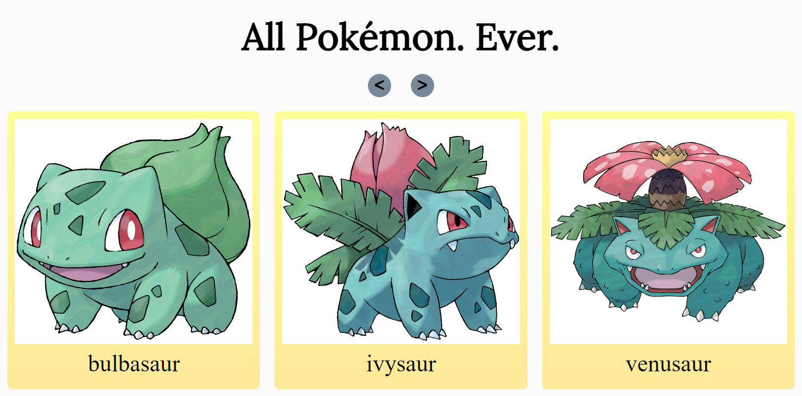
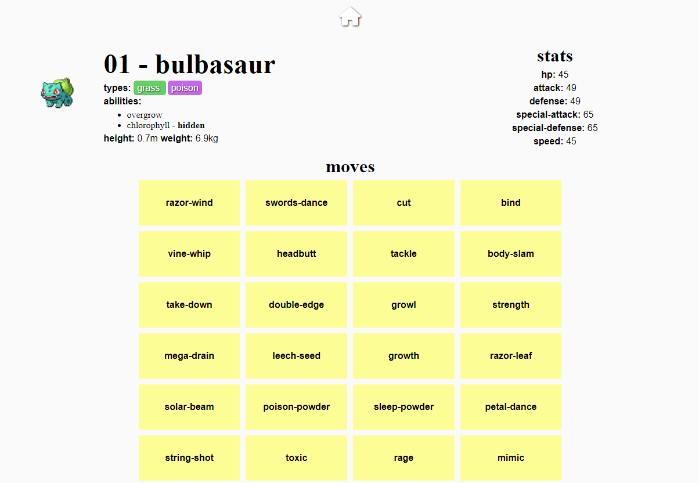

<!-- TABLE OF CONTENTS -->
<details>
  <summary>Table of Contents</summary>
  <ol>
    <li>
      <a href="#about-the-project">About The Project</a>
      <ul>
        <li><a href="#built-with">Built With</a></li>
      </ul>
    </li>
    <li><a href="#getting-started">Getting Started</a></li>
    <li><a href="#usage">Usage</a></li>
    <li><a href="#contact">Contact</a></li>
  </ol>
</details>


<!-- ABOUT THE PROJECT -->
## About The Project

[![Product Name Screen Shot][product-screenshot]](resources/homepage.png)


### Built With

* [![Svelte][Svelte.dev]][Svelte-url]

<p align="right">(<a href="#readme-top">back to top</a>)</p>


<!-- GETTING STARTED -->
## Getting Started

To access the project, first, clone the repository to gain access to the source code. Second, run the following:
* npm
  ```sh
  npm install
  npm run dev -- --open
  ```
  The first command installs all the required node modules that allow the project to run. The second runs the project in developer mode and opens it in a browser. Remove the `-- --open` if you don't want it to open automatically.


<!-- USAGE EXAMPLES -->
## Usage

This project is my personal spin on a Pokémon Encyclopedia, or simply Pokédex.


On the main page there is a gallery of 30 Pokémon cards which can be shifted using left and right arrow buttons. 



Each of these Pokémon cards, when clicked, leads to its own Pokédex entry to display more in-depth information about said Pokémon.

<p align="right">(<a href="#readme-top">back to top</a>)</p>


<!-- ROADMAP -->
## Roadmap

- [ ] Region based Pokédex (individual games)
- [ ] Type chart with attack and defense comparison
    - [ ] Expanded pages for each move attack and defense pros/cons
        - [ ] List of Pokémon that has the type selected
- [ ] List of all Pokémon moves
    - [ ] Expanded pages for each move by name/id

<p align="right">(<a href="#readme-top">back to top</a>)</p>


<!-- CONTACT -->
## Contact

John Wilson - wilsjw2@student.op.ac.nz

Project Link: [https://github.com/wilsjw/svelte_2023](https://github.com/wilsjw/svelte_2023)

<p align="right">(<a href="#readme-top">back to top</a>)</p>


<!-- MARKDOWN LINKS & IMAGES -->
<!-- https://www.markdownguide.org/basic-syntax/#reference-style-links -->
[product-screenshot]: resources/homepage.png
[Svelte.dev]: https://img.shields.io/badge/Svelte-4A4A55?style=for-the-badge&logo=svelte&logoColor=FF3E00
[Svelte-url]: https://svelte.dev/
